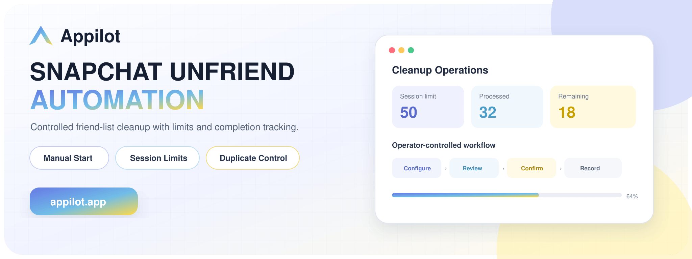
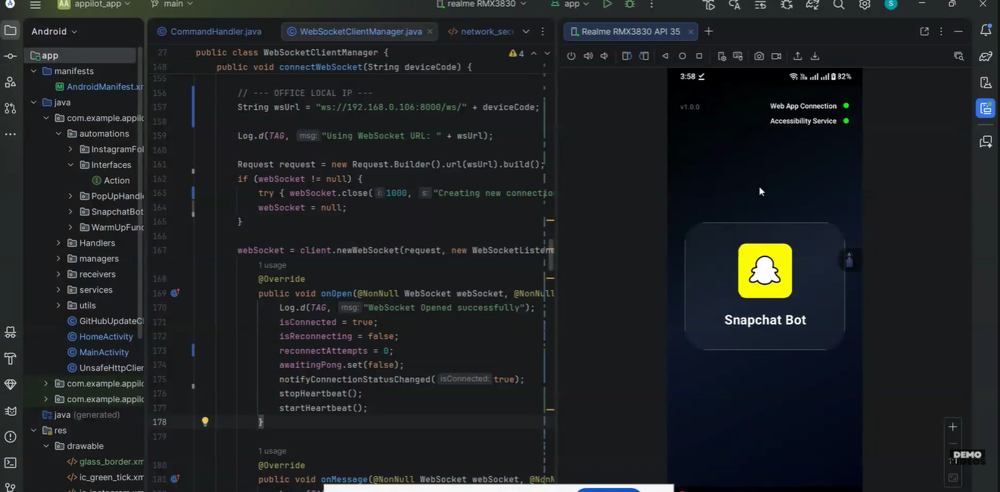
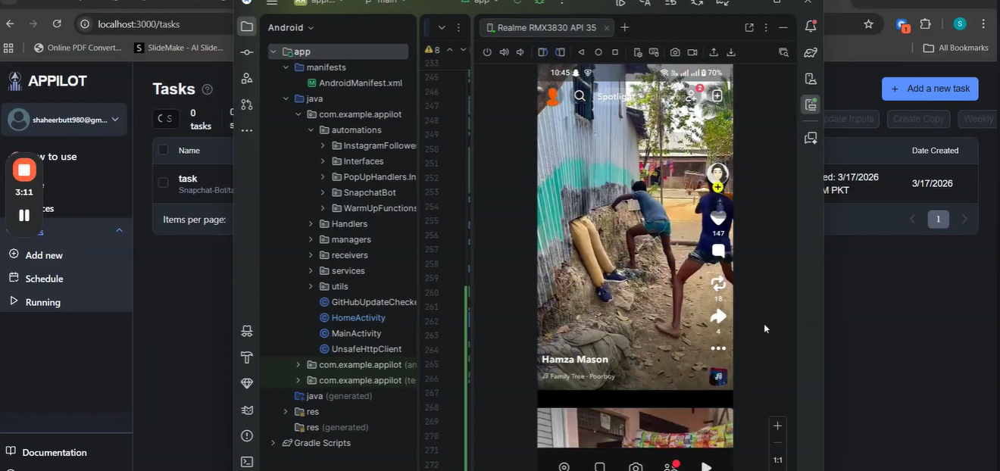
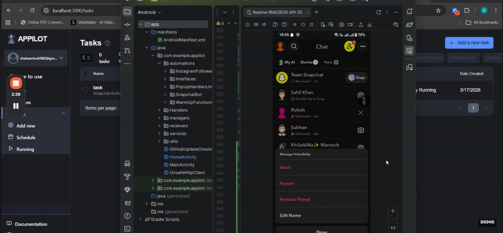
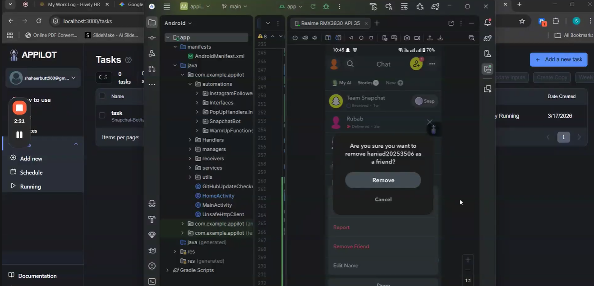

# Snapchat Unfriend Automation by Appilot

**An Appilot product showcase for operator-initiated friend-list cleanup inside the Snapchat Android application, with configurable session limits and completion tracking.**

[](https://www.appilot.app/) [](https://youtu.be/WGEJfNQ3Iyc)

## Demo Video

[](https://youtu.be/WGEJfNQ3Iyc)

**Watch on YouTube:** https://youtu.be/WGEJfNQ3Iyc

## Overview

This Android-based workflow helps an account owner clean up a large Snapchat friend list through controlled, manually initiated sessions. The operator selects a removal count, starts a task, monitors execution, and retains a record of processed accounts to prevent accidental duplicate work.

## Core Capabilities

| Capability | What it provides |
|---|---|
| **Manual task start** | Keeps each cleanup session under direct operator control. |
| **Configurable limits** | Caps removals according to the owner’s selected operating policy. |
| **Duplicate prevention** | Tracks processed accounts to avoid repeating completed work. |
| **Android execution** | Operates inside an authorized Snapchat mobile session. |
| **Confirmation handling** | Processes the supported remove-friend confirmation flow. |
| **Task monitoring** | Displays scheduled and running states in Appilot. |
| **Exception reporting** | Flags interrupted or unresolved steps for operator review. |
| **Custom workflow** | Adapts task inputs and reporting to the client’s cleanup process. |

## Workflow

1. The account owner defines the cleanup target and session limit.
2. Appilot creates a manually initiated task for the authorized Android device.
3. The mobile workflow opens eligible friend-management controls.
4. Each removal confirmation is processed under the configured limit.
5. Completed accounts are recorded to prevent duplicate handling.
6. The operator reviews results and exceptions before another session.

## Screenshots

<table align="center"><tr><td align="center" width="50%"><br><b>Authorized device readiness</b></td><td align="center" width="50%"><br><b>Appilot task running with Snapchat</b></td></tr><tr><td align="center" width="50%"><br><b>Friend-management controls</b></td><td align="center" width="50%"><br><b>Operator-configured removal flow</b></td></tr></table>

## Repository Contents

```text
snapchat-unfriend-automation/
├── README.md
├── ARCHITECTURE.md
├── DEMO.md
├── REPOSITORY-SETUP.md
├── RESPONSIBLE-USE.md
├── repo-metadata.json
├── LICENSE
├── .gitignore
└── assets/
    ├── banner.png
    ├── banner.svg
    └── screenshots/
```

## Need an Authorized Friend-List Cleanup Workflow?

Appilot can customize task limits, Android execution, duplicate prevention and reporting around your account-management process.

**[Discuss Your Project With Appilot](https://www.appilot.app/contact)**

[Visit Appilot](https://www.appilot.app/) · [Watch the Demo](https://youtu.be/WGEJfNQ3Iyc)

